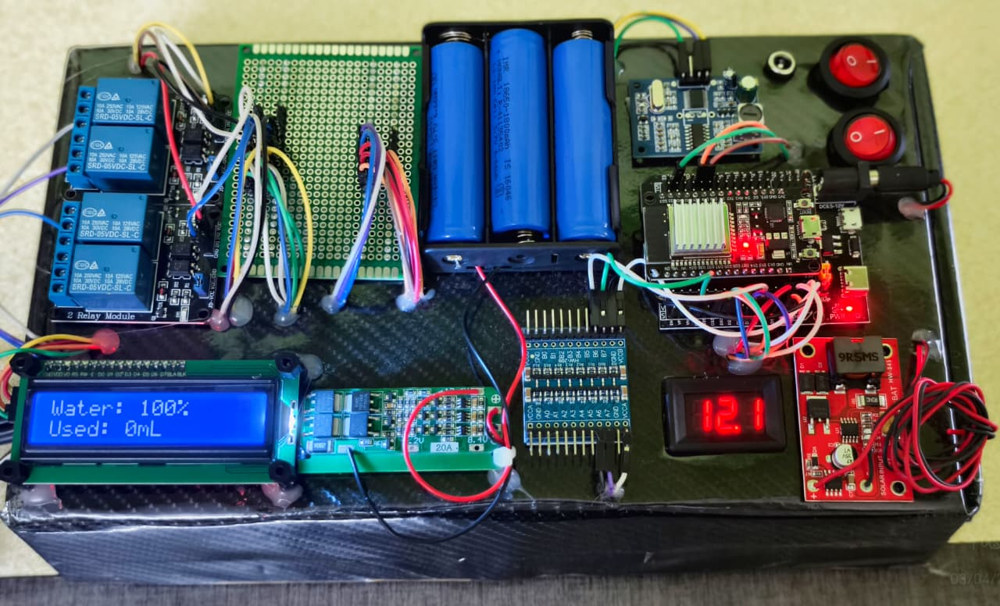
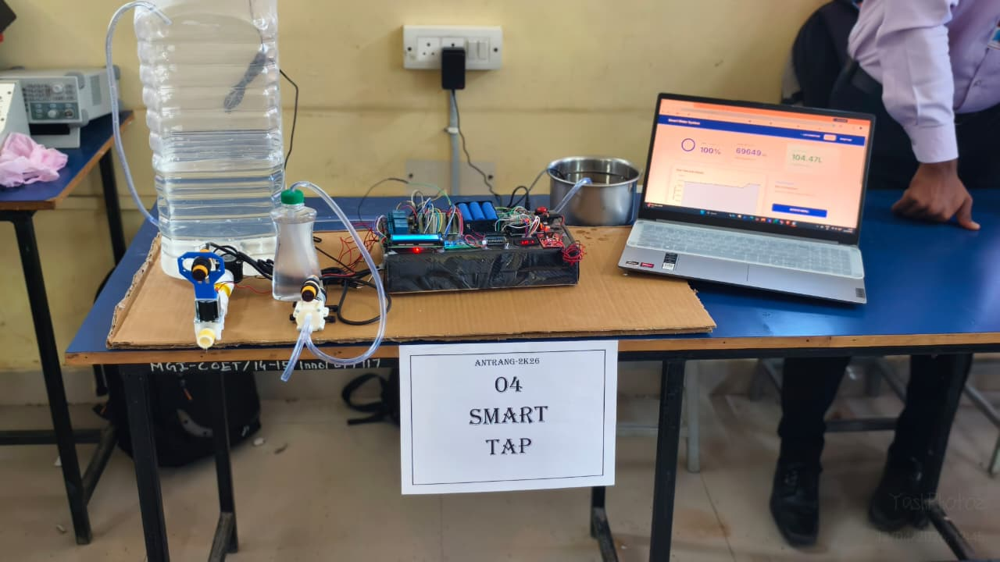
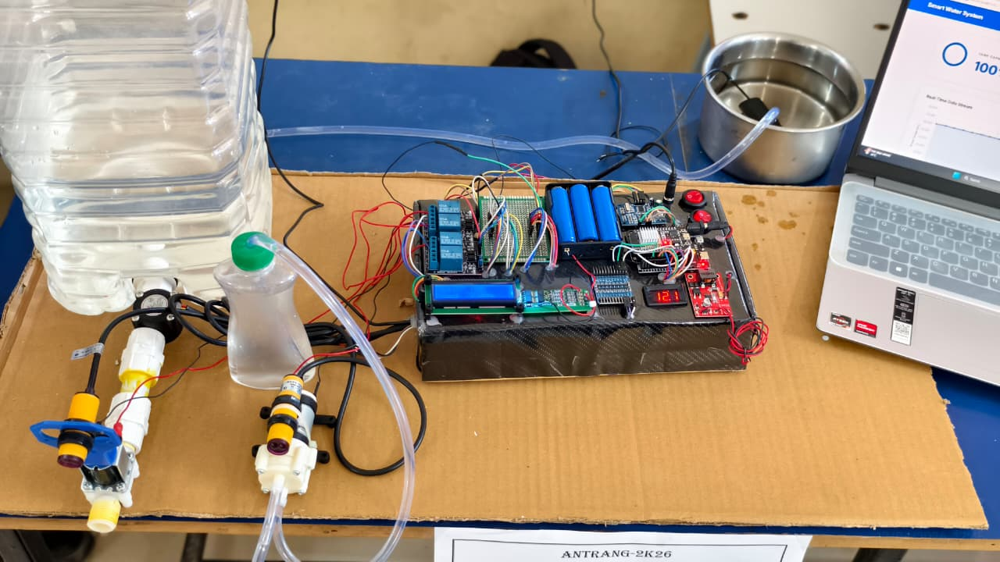

# IoT-Based Smart Sanitation and Water Telemetry System

An autonomous, contactless smart water management system bridging edge-computing hardware with cloud analytics to enforce hygiene, protect infrastructure, and audit water consumption.

## Key Features
* **Contactless Hygiene:** Eliminates fomite-based pathogen transmission using active IR proximity sensors.
* **Algorithmic Infrastructure Protection:** Utilizes deterministic hysteresis loops to autonomously manage tank levels, preventing overflows and motor cavitation.
* **Precise Volumetric Auditing:** Tracks water usage down to the milliliter via hardware flow sensor interrupts for data-driven ESG reporting.
* **Remote Administration:** Provides administrators with a secure web dashboard for live telemetry monitoring and low-latency, remote high-voltage pump control.

## Hardware Architecture
* ESP32 Development Board (Main Controller)
* SR04M-2 Waterproof Ultrasonic Sensor
* YF-S201 Hall-Effect Turbine Flow Sensor
* Active IR Proximity Sensor
* 4-Channel Opto-Isolated Relay Module
* 12V Solenoid Valve & DC Submersible Pump
* 16x2 I2C LCD Display

## Software & Tech Stack
* **Firmware:** C/C++ (ESP32)
* **Cloud Integration:** Firebase Realtime Database
* **Web Dashboard:** HTML, CSS, JavaScript

## Project Demonstration

Below are the visual demonstrations of the physical prototype, showcasing the custom control board, the sensor placements, and the real-time Firebase dashboard in action.

*Images will be displayed here:*

**1. Centralized Control Board & Microcontroller**

**2. Physical Sensor Placement & Water Tank**

**3. Complete Project Setup**

